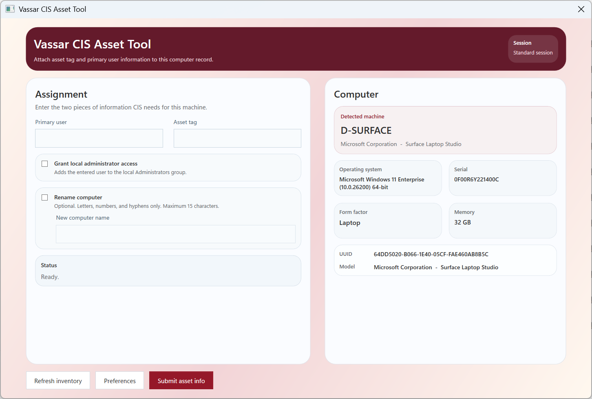

# Asset Tool

Asset Tool is an internal Vassar College CIS desktop utility for assigning an asset tag and primary user to a workstation, updating the related webhook-driven records, optionally renaming the computer, and optionally ensuring the user has local administrator access.



## What it does

- Captures local device inventory details
- Collects the primary user and asset tag for the machine
- Sends the two required webhook payloads
- Optionally renames the computer
- Optionally adds the entered user to the local `Administrators` group
- Prompts for domain credentials during rename when the computer is domain-joined

## Build

```powershell
$env:APPDATA='C:\AI\ModernAssetTool.App\AppData\Roaming'
$env:LOCALAPPDATA='C:\AI\ModernAssetTool.App\AppData\Local'
$env:USERPROFILE='C:\AI\ModernAssetTool.App'
$env:DOTNET_CLI_HOME='C:\AI\ModernAssetTool.App\.dotnet'
$env:NUGET_PACKAGES='C:\AI\ModernAssetTool.App\.nuget\packages'
$env:NUGET_HTTP_CACHE_PATH='C:\AI\ModernAssetTool.App\.nuget\http-cache'
& 'C:\Program Files\dotnet\dotnet.exe' build 'C:\AI\ModernAssetTool.App\ModernAssetTool.App.csproj' --configfile 'C:\AI\ModernAssetTool.App\NuGet.Config'
```

## Release Packaging

Run:

```powershell
& 'C:\Windows\System32\WindowsPowerShell\v1.0\powershell.exe' -NoProfile -ExecutionPolicy Bypass -File 'C:\AI\ModernAssetTool.App\Build-Release.ps1'
```

This produces:

- a GitHub-ready source archive
- an app archive
- a bootstrap installer that installs the .NET Desktop Runtime if needed
- an Intune `.intunewin` package
